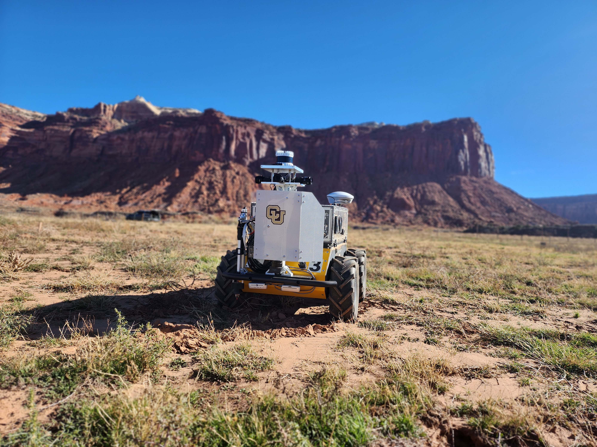
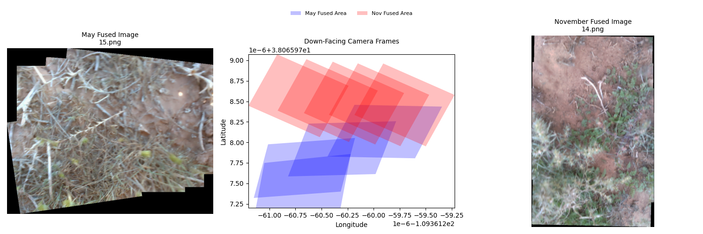
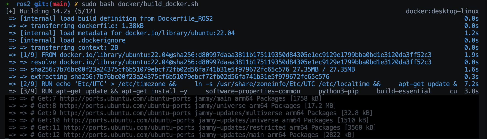

# Canyonlands Dataset Toolkit

Welcome to the **Canyonlands Dataset Toolkit** — a collection of Python tools designed to interact with the Canyonlands Dataset, available here: <LINK TO DATASET>

This repository provides a set of scripts that:

1. Search for corresponding image frames between seasons
2. Use covariance ellipsoids to identify well-localized frame clusters
3. Stitch image frames into coherent sets for cross-seasonal analysis
4. Compare sets of frames for visual changes over time
5. Convert the binarized dataset into ROS2 bags

<p align="center">  </p>

---

## 🧰 Key Features

- **GPS-Based Frame Matching**: Efficiently search and retrieve frames within spatial proximity across seasonal datasets.
- **Covariance Ellipsoid Filtering**: Select only those sets of frames that lie within a statistically meaningful localization boundary.
- **Temporal Stitching & Comparison**: Compare matched frame sets to observe environmental or scene-level changes between seasons.

---

## Getting Started

### 1. Download the Data
The data are divided between May and November, and subsequently by plot. 

<p align="left">  </p>

The original ROS1 rosbags are separately included under bags. To decompress, simply run:
```
rosbag decompress plotName.bag 
```

### 2. Clone the Repository & Install Dependencies 

```
git clone https://github.com/suchkristenwow/CanyonlandsDataset
cd ./CanyonlandsDataset
pip install .
```

You only need a ROS 1 installation if you intend to use the estimate_cam_frustum and related processing utilities. 

**Installation example for Ubuntu + ROS Noetic:**

```
sudo apt update
sudo apt install \
    ros-noetic-rospy \
    ros-noetic-rosbag \
    ros-noetic-sensor-msgs \
    ros-noetic-cv-bridge \
    ros-noetic-tf \
    ros-noetic-message-filters \
    ros-noetic-image-geometry
```

### 3. Example Usage: ROS 2 Rebagification
### 4. Example Usage: Multi-Seasonal Comparison
Set the desired paths and stitching parameters inside configs/your_config.toml, then run:

    python get_overlapping_frames.py --config configs/your_config.toml


This script iterates over each frame in May and searches for overlapping frames from the same plot in November whose centroid falls within the covariance associated with that timestamp. These frames are then temporarily chunked (to manage image size and memory usage) and stitched.In the center the frustrum of these frames is plotted in GPS coordinates. The paths to the constituent images are mapped to each stitched image and pickled. 

#### Example Output
<p align="center">  </p> 


## Dataset Configuration Files
The dataset includes all necessary calibration and configuration files to support usage and reproducibility:

LIOSAM Configuration Files: Located under configs/LIOSAM/.

- These YAML configuration files allow users to replicate odometry and mapping results in the map frame using the provided GPS and IMU data. 

## Down-Facing Camera Frustrum Estimation Pipeline 
We provide all the scripts used to estimate the GPS coordinates of the down-facing camera frames. For your convenience, you need only to run either ``processing_pipeline_May.py`` or ``processing_pipeline_Nov.py`` along with the desired plot name and configuration file containing the relevant paths.  
Additionally, to visualize the down-facing camera frustrum while playing the ROS bag, you can use either ``publishDownCamFrames_May.py`` or ``publishDownCamFrames_Nov.py`` 

### 5. ROS1/ROS2 Conversion From Unstructured

**Note: For users purely interested in ROS1 bag playback, we provide *raw* ROS1 bags directly for download. Additionally, if you already have the ROS1 of the sequence you'd like a ROS2 bag for, multiple tools exist to convert a ROS1 bag to ROS2 db3 file. *These instructions are so that users can download the binarized data and convert into a ROS2 bag as they please, without needing to redownload items.***

Make sure to download at least one of the binarized sequences of the CanyonLands Dataset. Also, if you dont yet have Docker on your machine, please make sure to install it now.

Enter the ros2_conversion directory available at the root of the repository.

```
cd ros2_conversion/
```

Here you can run the following:

```
sudo bash docker/build_docker.sh
```

This will build the Docker container needed to convert the unstructured files to a ROS2 bag. You should see the following:

<p align="center">  </p> 

Once the container is built, you will need to link it to the *conversion_scripts* directory in the *ros2_conversion* directory. To do this, you will need to update the bash file *run_and_enter_container.bash* in the *docker* directory with the global paths to where your *conversion_scripts* directory is and where you have stored the dataset on your machine. Also, make sure to update the *make_ros2_bag.py* file in this directory with the paths to where your unstructured directories are, as well as the sequence you will be converting to a ROS2 bag. 

After doing this, you should be able to enter the container.

Source ROS2 Humble using

```
source /opt/ros/humble/setup.bash
```

Convert the unstructured data you have specified to ROS2:

```
python conversion_scripts/make_ros2_bag.py
```

Once your ROS2 bag is ready, it will be in the DATASETS_DIR directory that you specified in the *run_and_enter_container.bash* bash script.
